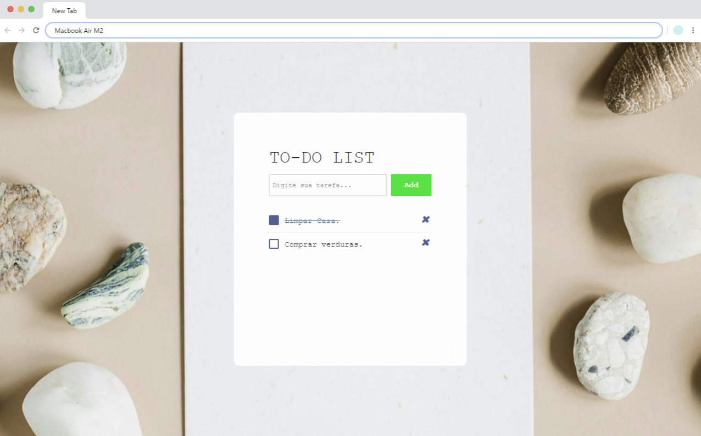

# Olá, eu sou a Andressa! 👋
## 🚀 Sobre mim
Eu sou uma pessoa desenvolvedora full-stack...

# To-do List
A proposta para o desenvolvimento deste projeto foi a construção de um To-do list para criar uma lista de afazeres diários, semanais ou mensais. Utilizando dos recursos aprendidos durante as aulas do curso de programação FullStack com o professor Walace Oliveira.
- [To-do List](https://andressa-l.github.io/listador-de-tarefas/)

## Funcionalidades

- Exibição da tela: a tela mostra o campo para adicionar a tarefa.
- Quando adiciona uma nova tarefa direciona para a lista abaixo.
- Na listagem abaixo o usuário pode selecionar ou remover suas tarefas.
- Personalização de estilo: o gerenciador de tarefas foi personalizado com fontes, cores, tamanhos e formatos de exibição.

## Screenshot

  <h3>Tela To-do List</h3>
  

## Aprendizados

- Utilizar HTML5 para criar o layout da aplicação.
- Trabalhar com CSS3 para estilização dos elementos.
- Desenvolver habilidades em JavaScript.

> <em>Aqui consta as principais tecnologias usadas, podem ser abordadas outras no desenvolvimento do projeto, basta conferir o código completo. </em>

## 🛠 Habilidades
- Javascript
- HTML 
- CSS
- Bootstrap

## Autores

- [@andressa-l](https://www.github.com/andressa-l)

Feito com 💜 por <a href="https://github.com/andressa-l">Andressa</a>.

 